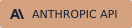
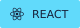
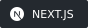
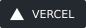
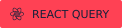

# Onur Ergüden

**Software & AI Engineer**

I build AI applications, APIs, and web & mobile products. Recent work includes a local course assistant, a strength coach connected through MCP, and drinking-water safety research.

[Portfolio & case studies](https://onurerguden.dev) · [LinkedIn](https://www.linkedin.com/in/onurerguden/) · [Email](mailto:onurerguden5@gmail.com)

<picture>
  <source media="(max-width: 600px) and (prefers-color-scheme: dark)" srcset="assets/engineering-narrow-dark.svg">
  <source media="(max-width: 600px)" srcset="assets/engineering-narrow-light.svg">
  <source media="(prefers-color-scheme: dark)" srcset="assets/engineering-wide-dark.svg">
  
</picture>

## Selected work

### Course Intelligence RAG

A local assistant for university course documents, with department-aware retrieval, hierarchical chunks, and a desktop interface.

Python · Llama 3.1 · SBERT · FAISS 
[RAG code](https://github.com/onurerguden/IEU-Chat-Bot) · [RAG case study](https://onurerguden.dev/en/projects/course-intelligence)

### GymRap AI Coach

Connects Android health data to ChatGPT through authenticated MCP tools. Training calculations run in code; the model handles coaching.

Kotlin · TypeScript · Health Connect · MCP 
[GymRap code](https://github.com/onurerguden/GymRap-AI-Coach) · [GymRap case study](https://onurerguden.dev/en/projects/gymrap-ai-coach)

### TaskFoo

A project-management app with projects, epics, task workflows, role-based access, and real-time updates. Built during my software engineering internship.

Java · Spring Boot · React · PostgreSQL 
[TaskFoo code](https://github.com/onurerguden/TaskFoo)

### HealthFactor-AI

Research into drinking-water safety classification and trend prediction, with separate evaluation of real and simulated contamination data.

Python · scikit-learn · Time-series analysis 
[Water safety code](https://github.com/onurerguden/izsu_ai_project) · [Water safety case study](https://onurerguden.dev/en/projects/water-safety)

I also co-developed **[Kuyumcum](https://onurerguden.dev/en/projects/kuyumcum)**, a closed-source Flutter product for precious-metal holdings and local merchants, and engineered its AI features.

More work: [İzmir transport demand analysis](https://github.com/onurerguden/IZMIR-PUBLIC-TRANSPORTATION-ML) · [Portfolio source](https://github.com/onurerguden/onurerguden-portfolio)

## Stack

**Languages & markup**

  
  
  
  
  
  
  
  
  
  
  
  
  
  

**AI & data**

  
  
  
  
  
  
  
  
  
  
  
  
  
  
  
  

**Web & mobile**

  
  
  
  
  
  
  
  
  
  
  
  

**Infrastructure & tools**

  
  
  
  
  
  
  
  
  
  
  
  
  
  

More frameworks, libraries & tooling

  
  
  
  
  
  
  
  
  
  
  
  
  
  
  
  
  
  
  
  
  
  
  
  
  
  
  
  
  
  
  
  
  
  
  
  
  
  

[Full technology inventory](docs/technology-inventory.md), including additional detected languages and dependencies.

## Connect with me

  
  
  
  
  

## GitHub activity

  <picture><source media="(max-width: 600px) and (prefers-color-scheme: dark)" srcset="assets/activity-narrow-dark.svg"><source media="(max-width: 600px)" srcset="assets/activity-narrow-light.svg"><source media="(prefers-color-scheme: dark)" srcset="assets/activity-dark.svg"></picture>
  <picture><source media="(max-width: 600px) and (prefers-color-scheme: dark)" srcset="assets/code-languages-narrow-dark.svg"><source media="(max-width: 600px)" srcset="assets/code-languages-narrow-light.svg"><source media="(prefers-color-scheme: dark)" srcset="assets/code-languages-dark.svg"></picture>

Updated daily. Language percentages describe repository code, not skill levels. [About these visuals](docs/profile-visuals.md).

<picture>
  <source media="(prefers-color-scheme: dark)" srcset="assets/contribution-snake-soft-dark.svg">
  
</picture>

## Background

Experience, education & research

- **Future Is Now · AI Engineer**, July 2026–present. Previously AI Engineer Intern, April–June 2026. Client-facing AI applications, LangChain/LangGraph workflows and Qdrant-based retrieval.
- **VBT Software · Software Engineering Intern**, August–September 2025. Spring Boot, React, TypeScript and PostgreSQL in Scrum-based sprints.
- **BMC Otomotiv · Software Engineering Intern**, July–August 2025. SAP ABAP applications for intern management and warehouse inventory.

**BSc Software Engineering**, İzmir University of Economics · June 2026 · GPA **3.30/4.00**

**Google AI & Technology Academy graduate**, 2026 · Deep Learning training

Co-author of *Two-layered Artificial Intelligence System to Assess and Forecast the Safety Level of Drinking Water Resources*. [Research context and current status](https://onurerguden.dev/en/research).

Turkish (native) · English (C1)

Away from the keyboard, I'm usually playing basketball or tennis, or reading.

For project details or a copy of my CV: [onurerguden.dev](https://onurerguden.dev) · [Email me](mailto:onurerguden5@gmail.com).
