# Onur Ergüden

**Software & AI Engineer**

I build RAG applications and tool-calling workflows, mostly with Python, LangGraph and Qdrant. I also work on the product around them: APIs, React interfaces and mobile apps.

My recent projects include a local curriculum assistant, drinking-water safety research and a personal strength coach connected to ChatGPT through MCP. I like working through the details: what gets retrieved, how answers are evaluated and what happens when a tool call fails.

[Portfolio & case studies](https://onurerguden.dev) · [LinkedIn](https://www.linkedin.com/in/onurerguden/) · [Email](mailto:onurerguden5@gmail.com)

## Stack

**Languages**

<picture>
  <source media="(prefers-color-scheme: dark)" srcset="assets/tech/languages-dark.svg">
  
</picture>

Python · TypeScript · Java · Kotlin · Dart

**AI & retrieval**

  
  
  
  

<picture>
  <source media="(prefers-color-scheme: dark)" srcset="assets/tech/ml-dark.svg">
  
</picture>

PyTorch · TensorFlow · scikit-learn

**Web & mobile**

<picture>
  <source media="(prefers-color-scheme: dark)" srcset="assets/tech/web-mobile-dark.svg">
  
</picture>

React · Next.js · FastAPI · Spring Boot · Flutter

**Data & infrastructure**

<picture>
  <source media="(prefers-color-scheme: dark)" srcset="assets/tech/data-tools-dark.svg">
  
</picture>

PostgreSQL · Firebase · SQLite · Docker · Git · Cloudflare

## Selected projects

| Project | The work behind it |
| --- | --- |
| [Course Intelligence RAG](https://github.com/onurerguden/IEU-Chat-Bot) | Local Llama 3.1, SBERT and FAISS over university course documents. Department-aware retrieval, hierarchical chunks and a PyQt6 interface. [Case study](https://onurerguden.dev/en/projects/course-intelligence) |
| [GymRap AI Coach](https://github.com/onurerguden/GymRap-AI-Coach) | An Android Health Connect bridge, a Cloudflare backend and OAuth-protected MCP tools. Training numbers are computed in code; ChatGPT writes the coaching. [Case study](https://onurerguden.dev/en/projects/gymrap-ai-coach) |
| [HealthFactor-AI](https://github.com/onurerguden/izsu_ai_project) | Drinking-water safety classification and trend prediction. The research separates real and simulated contamination results and checks for data leakage. [Case study](https://onurerguden.dev/en/projects/water-safety) |
| [TaskFoo](https://github.com/onurerguden/TaskFoo) | A Spring Boot and React project-management app I built at VBT Software: projects, epics, task workflows, role-based access and real-time updates. |

I also co-developed **[Kuyumcum](https://onurerguden.dev/en/projects/kuyumcum)** and engineered its AI features. It's a Flutter product for precious-metal holdings and local merchants; the case study covers my contribution to the closed-source app.

More work: [İzmir transport demand analysis](https://github.com/onurerguden/IZMIR-PUBLIC-TRANSPORTATION-ML) · [The source behind my portfolio](https://github.com/onurerguden/onurerguden-portfolio)

## GitHub activity

<picture>
  <source media="(prefers-color-scheme: dark)" srcset="assets/stats-dark.svg">
  
</picture>
<picture>
  <source media="(prefers-color-scheme: dark)" srcset="assets/languages-dark.svg">
  
</picture>

Updated daily. Language percentages describe code in public repositories, not skill levels. [About these visuals](docs/profile-visuals.md).

### Contribution snake

<picture>
  <source media="(prefers-color-scheme: dark)" srcset="assets/snake-dark.svg">
  
</picture>

## Background

Experience, education & research

- **Future Is Now · AI Engineer**, July 2026–present. Previously AI Engineer Intern, April–June 2026. Client-facing AI applications, LangChain/LangGraph workflows and Qdrant-based retrieval.
- **VBT Software · Software Engineering Intern**, August–September 2025. Spring Boot, React, TypeScript and PostgreSQL in Scrum-based sprints.
- **BMC Otomotiv · Software Engineering Intern**, July–August 2025. SAP ABAP applications for intern management and warehouse inventory.

**BSc Software Engineering**, İzmir University of Economics · June 2026 · GPA **3.30/4.00**

**Google AI & Technology Academy graduate**, 2026 · Deep Learning training

Co-author of *Two-layered Artificial Intelligence System to Assess and Forecast the Safety Level of Drinking Water Resources*. [Research context and current status](https://onurerguden.dev/en/research).

Turkish (native) · English (C1)

Away from the keyboard, I'm usually playing basketball or tennis, or reading.

For project details or a copy of my CV: [onurerguden.dev](https://onurerguden.dev) · [onurerguden5@gmail.com](mailto:onurerguden5@gmail.com)
